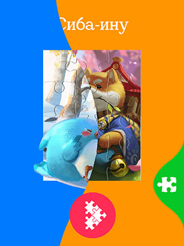
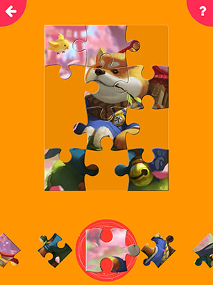

# React Native - Puzzle game
A personal project to showcase my code.\
The small puzzle game with liquid swipe menu.\
 

I used Gesture-Handler for interactions and Reanimated 2 for animations, also some Lottie's for more interesting look. The liquid effect was done with dynamic svg curves (iOS-version also has a mask effect as it is hardware accelerated).  

Here's the Figma project with Flow prototype and YouTube video of the App:\

You can try it on your device with the Expo Go (https://expo.dev/client). \
Just scan this QR-code with the mobile app:\
 \
*exp://exp.host/@afctemka/expo-puzzle*
