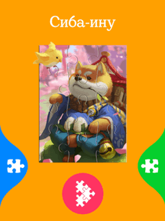

# React Native - Puzzle game
A small puzzle game with liquid swipe menu. A personal project.

I used [Gesture Handler](https://github.com/software-mansion/react-native-gesture-handler) for interactions and [Reanimated 2](https://github.com/software-mansion/react-native-reanimated) for animations, also some [Lottie's](https://github.com/lottie-react-native/lottie-react-native) for more interesting look. The liquid effect was done with dynamic [svg](https://github.com/react-native-svg/react-native-svg) curves (iOS-version also has a mask effect as it is hardware accelerated).

For UI/UX design I used Figma. Here's the project with Flow prototype:\

You can try this app on your device with the [Expo Go](https://expo.dev/client). \
Just scan this QR-code with the mobile app:

